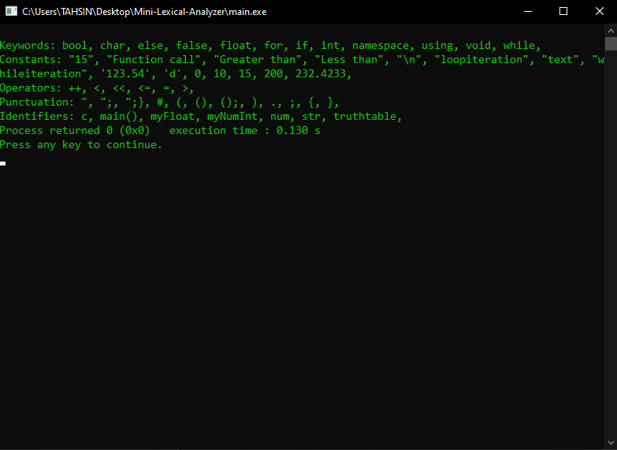

# C++ Program for Lexical Analyzer

After executing the program the list of all Keywords, Constants, Operators, Punctuation, Identifiers are displayed in the terminal depending on the code provided in <code>code.txt</code> file.
